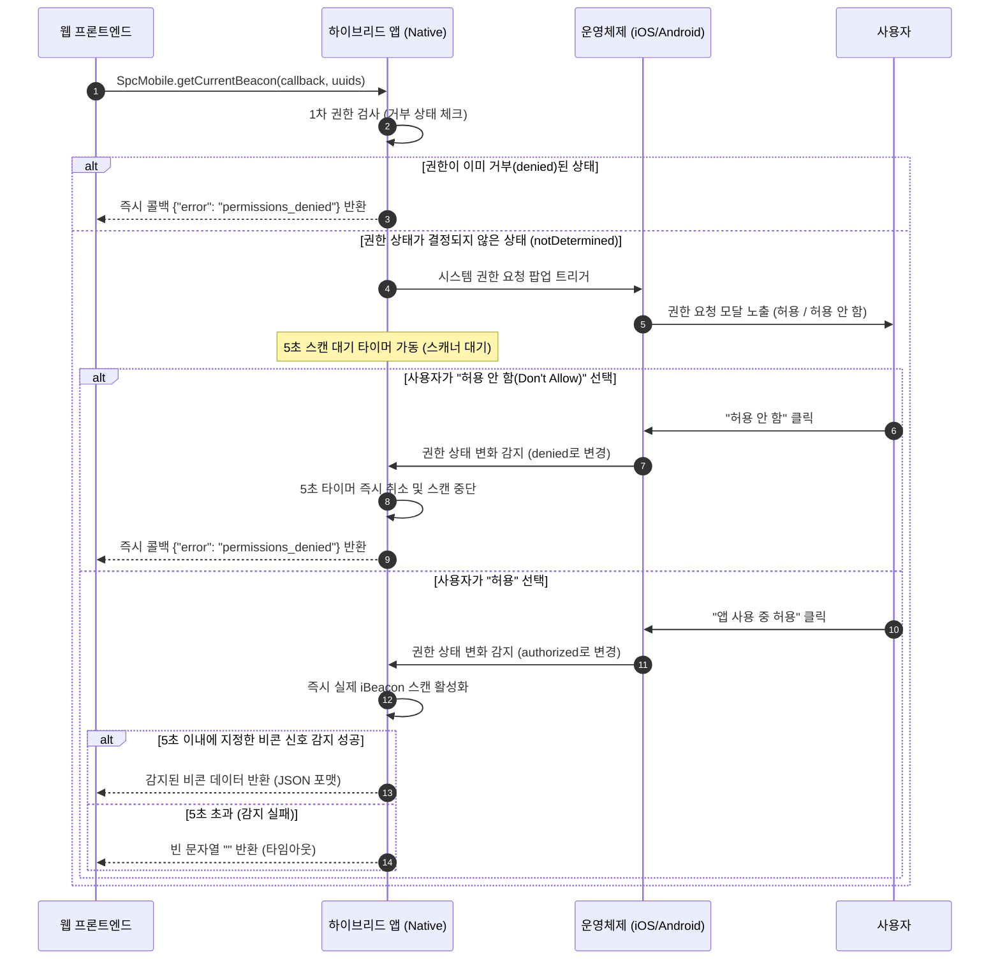

# SPC HR 모바일 권한 처리 및 비콘 스캔 플로우 가이드라인

본 문서는 SPC HR 모바일 앱(iOS/Android)에서 비콘 탐지 시 발생하는 위치 및 블루투스 권한 처리 메커니즘과 비동기 권한 요청에 따른 대응 플로우를 설명합니다.

---

## 1. 플랫폼별 요구 권한 비교

| 기능 | iOS 요구 권한 | Android 요구 권한 | 설명 |
| :--- | :--- | :--- | :--- |
| **iBeacon Ranging** (실제 출퇴근) | 위치 정보 권한 (`CLAuthorizationStatus`) | 위치 정보 권한 (`ACCESS_FINE_LOCATION`) | iBeacon 탐지 및 거리/신호 세기 측정을 위한 필수 권한 |
| **BLE Scan** (진단용 전체 스캔) | 블루투스 권한 (`CBManagerAuthorization`) | 블루투스 권한 (`BLUETOOTH_SCAN`, `BLUETOOTH_CONNECT`) | 전체 BLE 기기 탐색을 위한 원시 데이터 분석 권한 |

> [!NOTE]  
> iOS에서 표준 iBeacon을 탐지할 때(`locationManager.startRangingBeacons`)는 블루투스 권한 팝업이 아닌 **위치 정보 권한 동의** 팝업만 요청됩니다. 내부적으로 시스템 수준에서 블루투스를 활용하기 때문입니다.

---

## 2. 비동기 권한 요청 및 반응형 피드백 플로우

모바일 앱 최초 실행 또는 권한 상태가 설정되지 않은(`notDetermined` / 미동의) 상태에서 비콘 스캔 브릿지(`getCurrentBeacon`)를 호출할 때의 상세 플로우입니다.



---

## 3. 권한 변경 감지 구현 상세 (iOS 기준)

사용자가 팝업창에서 결정을 내리는 시간 동안 앱은 5초 대기 상태에 들어갑니다. 사용자의 실시간 거절 응답을 타임아웃 대기 없이 즉각 프론트엔드에 피드백하기 위해 다음과 같이 델리게이트와 반응형 구독 모델을 바인딩하여 처리합니다.

### A. BeaconManager의 권한 상태 퍼블리셔 등록
[BeaconManager.swift](file:///Users/gsitm/dev/01_GSITM/SPCHR/iOS/SPCHR/Beacon/BeaconManager.swift)에서 위치 정보 권한 변경 이벤트를 외부에서 구독할 수 있도록 `@Published` 속성으로 노출합니다.
```swift
@Published private(set) var authorizationStatus: CLAuthorizationStatus = .notDetermined

func locationManagerDidChangeAuthorization(_ manager: CLLocationManager) {
    // 권한 상태가 갱신되면 바인딩된 퍼블리셔가 이벤트를 방출
    self.authorizationStatus = manager.authorizationStatus
}
```

### B. WebViewScreen의 실시간 거부 감지 및 콜백 송신
[WebViewScreen.swift](file:///Users/gsitm/dev/01_GSITM/SPCHR/iOS/SPCHR/WebView/WebViewScreen.swift)의 Coordinator에서 스캔 대기 시작과 동시에 권한 변화를 관찰합니다.
```swift
// 스캔 시작 시 권한 변경 모니터링 구독 등록
permissionCancellable = beaconManager.$authorizationStatus
  .filter { $0 == .denied || $0 == .restricted }
  .first()
  .sink { [weak self] _ in
    Task { @MainActor in
      // 사용자가 팝업창에서 '허용 안 함'을 누르는 즉시 호출됨
      self?.resolveCallback(callbackName: callbackName, resultJsonString: "{\"error\":\"permissions_denied\"}")
      self?.cancelScan() // 스캔 및 5초 타이머 작업 강제 취소
    }
  }
```

이와 같은 반응형 예외 처리를 통해 하이브리드 웹에서는 권한 거부 상황에서 불필요한 5초 대기 딜레이를 겪지 않고, 사용자에게 빠른 안내 화면(예: 설정 앱으로 이동 유도)을 제공할 수 있습니다.
